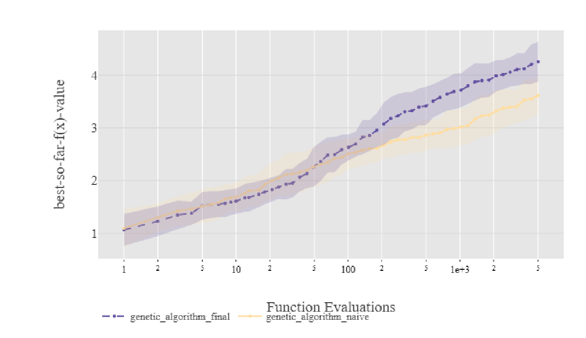
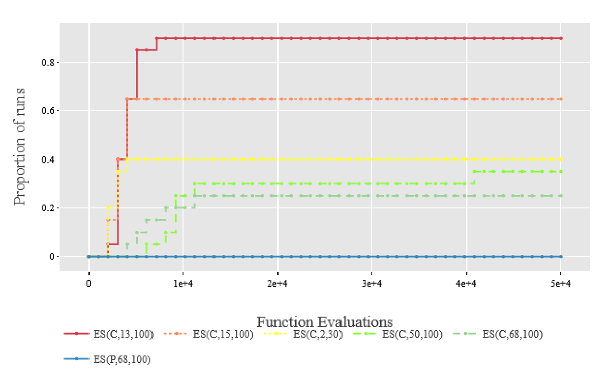

# Tuning Genetic Algorithms and Evolutionary Strategies  
### For the Low Autocorrelation Binary Sequences, N-Queens, and Katsuura Problems  

**Authors:**  
- Andrew Spiro 
- Eefje Karremans   
**Date:** December, 2024  

---

## Project Overview

This project explores how **Genetic Algorithms (GAs)** and **Evolutionary Strategies (ES)** can be tuned and optimized for three well-known benchmark problems:

1. **Low Autocorrelation Binary Sequences (LABS)** – from PBO-F18  
2. **N-Queens Problem** – from PBO-F23  
3. **Katsuura Function** – from BBOB-F23  

Our goal was to:
- Implement and tune a GA to perform effectively on LABS and NQueens.
- Apply an ES to the Katsuura function and optimize its performance using self-adaptive mutation rates.

The tuning process compared several search strategies: **manual tuning**, **grid search**, **random search**, and **Bayesian Optimization (BO)**.
We had chosen to add BO  since i had started that course and wanted to try out the possiblest with other algorithms.

---

## Genetic Algorithm (GA)

### Approach
We developed and tuned a **Genetic Algorithm** with:
- **Tournament selection**
- **n-point crossover**
- **Comma selection**

### Baseline vs Tuned GA

| Parameter | Baseline | Tuned (Final) |
|------------|-----------|---------------|
| Population (μ) | 3 | 10 |
| Mutation rate (pm) | 0.02 | 0.03 |
| Crossover rate (pc) | 0.6 | 0.5 |
| Selection | Proportional | Tournament (k=10) |
| Crossover | Uniform | 5-point |

**Algorithmic Steps:**
1. Initialize population  
2. Apply selection  
3. Perform crossover  
4. Mutate offspring  
5. Replace parents  
6. Repeat until budget is reached  

### Tuning Setup
- **Runs per configuration:** 20  
- **Evaluations per run:** 5,000  
- **Search space:**
  - Population size: 10–20  
  - Crossover points: 1–5  
  - Tournament size (k): 1–10  
  - Mutation rate: 0.02–0.5  
  - Crossover rate: 0.5–0.95  

Bayesian Optimization (BO) was found to be **the most effective** tuning method, outperforming grid and random search.

---

## Results: GA on LABS and NQueens

### LABS Results

| Metric | Baseline | Tuned GA |
|--------|-----------|----------|
| Mean | 3.62 | **4.26** |
| Std. Dev. | 0.34 | 0.37 |
| p-value | 4.36e-5 | — |

### NQueens Results

| Metric | Baseline | Tuned GA |
|--------|-----------|----------|
| Mean | 2.60 | **6.80** |
| Std. Dev. | 2.85 | 0.41 |
| p-value | 5.63e-6 | — |

The tuned GA showed a **statistically significant improvement** in both problems.  
Tournament selection and multi-point crossover were key contributors to better exploration.

---

## Evolutionary Strategies (ES)

### Approach
For the **Katsuura Function (BBOB-F23)**, we implemented ES with:
- **Self-adapting σ (mutation rate)**  
- **(μ, λ)** and **(μ + λ)** strategies  
- **Different σ-update mechanisms:** single, individual, and correlated

**Best configuration found via BO:**
| Parameter | Value |
|------------|-------|
| μ (parents) | 13 |
| λ (offspring) | 100 |
| σ₀ (initial sigma) | 0.073 |
| Strategy | (μ, λ) |
| Sigma update | Individual |

### Observations
- Increasing **λ (offspring)** while reducing **μ (parents)** improved performance.  
- The **comma (μ, λ)** strategy avoided local optima better than the **plus (μ + λ)** variant.  
- A smaller μ led to a rapidly increasing σ, which was stabilized using a cosine-based limiter.
**Final performance:** best solution reached **≈7.3**, close to the known global optimum (6.87).

---

## Key Insights

### GA
- Tournament selection outperforms proportional selection.  
- n-point crossover (5 points) improves exploration.  
- BO tuning yielded significant gains over manual tuning.  
- Mutation rate ≈ 1.5 × (1/n) performed best.  

### ES
- Smaller μ and larger λ lead to better global search.  
- (μ, λ) strategy prevents local stagnation.  
- Sigma stability critically affects convergence.  
- Some “accidental” sigma behaviors led to near-optimal results (6.9).

---

## Discussion

This project demonstrates that **automated hyperparameter tuning** via **Bayesian Optimization** can outperform traditional manual or grid methods for both GA and ES.  
For the given benchmark problems, BO led to faster convergence, more stable fitness values, and improved reproducibility.

Future work could explore:
- Dynamic budgeting (adaptive number of runs/evaluations)  
- Alternative acquisition functions in BO  
- Integration with **IOHprofiler** for automatic benchmarking  

---

## References
1. Doerr et al., *Benchmarking Discrete Optimization Heuristics with IOHprofiler*, GECCO 2019.  
2. Packebusch & Mertens, *Low Autocorrelation Binary Sequences*, J. Phys. A, 2016.  
3. Finck et al., *Real-Parameter Black-Box Optimization Benchmarking 2009*.  
4. Wang et al., *IOHanalyzer: Detailed Performance Analyses for Iterative Optimization Heuristics*, 2022.  
5. De Jong, *Analysis of Genetic Adaptive Systems*, 1975.  

