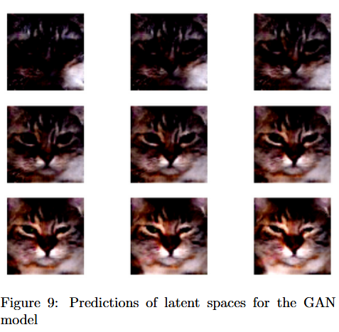
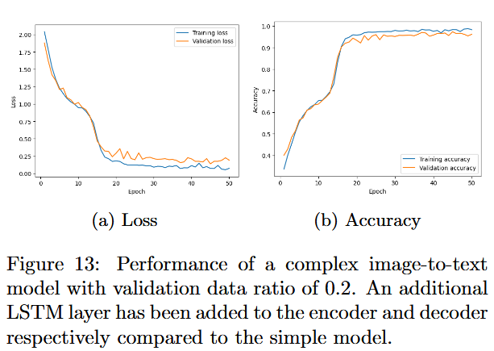

# Introduction to Deep Learning - A2 (Group 87)
**A. Stegenga, E.A. Karremans , P. Chang **
**December 2024**

---

## 1. Introduction

In this assignment, we explore the functionality and applications of **generative models**, which are capable of creating new content or reconstructing existing data. These models can recover incomplete images, generate entirely new images within certain categories, or interpret textual input to produce visual outputs. To demonstrate these capabilities, we use a labeled dataset of cat face images, formatted similarly to MNIST, alongside a sequence-to-sequence dataset for arithmetic equations.

The report is structured as follows:
1. Challenges and mechanisms behind generative models.
2. Implementation of sequence-to-sequence frameworks in three variations: text-to-text, image-to-text, and text-to-image.
3. Analysis and comparison of each model's performance.

### 1.1 Generative Models

Generative models are versatile tools used across image, audio, and video generation. Beyond creating new content, they can restore missing sections of existing content. For example, **super-resolution techniques** enhance low-resolution images to higher resolution [1].

**Generative Adversarial Networks (GANs)** [5] consist of a generator and a discriminator. The generator creates new images, while the discriminator evaluates whether an image is real or generated. Training involves a minimax game that refines both networks. GANs are **unsupervised**, requiring no labeled data.

**Variational Autoencoders (VAEs)** [8] use a probabilistic approach. An encoder maps input data to a latent distribution, and a decoder samples from this distribution to reconstruct images. VAEs often produce blurrier images than GANs but have smoother latent representations. Training involves two loss terms: reconstruction loss and **Kullback-Leibler (KL) divergence**, which regularizes the latent space.

### 1.2 Sequence-to-Sequence Models

Sequence-to-sequence (S2S) models capture relationships within ordered data. They are particularly useful in tasks like speech recognition, machine translation, or arithmetic problem-solving. Common architectures include **RNNs, LSTMs** [6], and **GRUs** [3].

### 1.3 Datasets

We use two datasets:

1. **Cat face dataset** [2]: Over 23,000 images; we use 20,000 due to memory limits. Images are 64×64 RGB pixels, varying in completeness.
2. **Arithmetic dataset**: Handwritten digits (MNIST [4]) with operators `+` and `−`. Each input combines five images to form an equation (e.g., `14+26`) with a three-character output.

---

## 2. Methods

### 2.1 Convolutional Autoencoders (CAE)

We start with a **CAE** to demonstrate image reconstruction. The structure follows the provided example, with minor adjustments to convolutional layers. CAEs capture essential features and serve as a baseline.

### 2.2 Variational Autoencoders (VAE)

The **VAE** learns distributions rather than fixed outputs.
- Latent space dimensionality: 32
- Decoder reconstructs images by sampling the latent distribution.
- Produces blurrier but structured images.
- Trained for up to 75 epochs, batch size 8, max filter size 128.

**Base model features:**
- 4 convolutional layers, Leaky ReLU activations
- ReLU for deconvolutions
- Binary cross-entropy loss, Adam optimizer [7]

### 2.3 Generative Adversarial Networks (GAN)

The **GAN** has a generator and discriminator:
- Generator: maps 512-dim noise to images
- Discriminator: classifies images as real/fake
- Training: batch size 64, learning rate 0.0002, 200 epochs, 128-filter kernel, tanh activation

GANs produce sharper images than VAEs but are less stable during training.

### 2.4 Long Short-Term Memory (LSTM) Models

We applied **LSTMs** for three sequence-to-sequence tasks:

1. **Text-to-Text (T2T)**
   - Encode 5-character sequences (equations)
   - Decode to 3-character results
   - LSTM layers: 256 nodes, repeat vector, TimeDistributed dense output

2. **Image-to-Text (I2T)**
   - Extract features with 3 CNN layers (32, 64, 128 kernels)
   - LSTM encoder-decoder translates features to text

3. **Text-to-Image (T2I)**
   - Generate 28×28 images of results
   - Encoder: 256-node LSTM, repeat vector
   - Loss: pixel-wise MSE, visual inspection

---

## 3. Experiments and Results

### 3.1 CAE Reconstruction

- CAE captures essential features of cat faces.
- Performance plateaus after ~40 epochs.

### 3.2 VAE Generation

- Structured facial features appear immediately.
- Backgrounds may be inconsistent, but eyes, noses, and faces are recognizable.

### 3.3 GAN Generation

- Produces sharper images than VAE.
- Early outputs often distorted due to adversarial training instability.

### 3.4 Sequence-to-Sequence

| Model | Accuracy | Notes |
|-------|---------|-------|
| Text-to-Text | High | Misclassifications with negative results or multi-digit outputs |
| Image-to-Text | Medium | Slightly lower due to image feature extraction |
| Text-to-Image | Low | Visual plausibility, multi-digit and negative numbers challenging |

---

## 4. Discussion

- **VAEs**: Smooth latent representations, slightly blurry images
- **GANs**: Sharp outputs, unstable training
- **CAEs**: Quick reconstruction, limited detail
- **Sequence-to-Sequence**: Flexible for text/image translation, image generation remains challenging

---

## 5. Conclusion

Generative models are powerful for content reconstruction and creation. This assignment demonstrates CAEs, VAEs, GANs, and sequence-to-sequence models, emphasizing architecture choices, latent space design, and training strategies. Combining these approaches provides a versatile toolkit for image and text generation tasks.

---

**Placeholders:**
- Figures for CAE, VAE, GAN outputs
- Sequence-to-sequence performance plots
- Example equations/images

